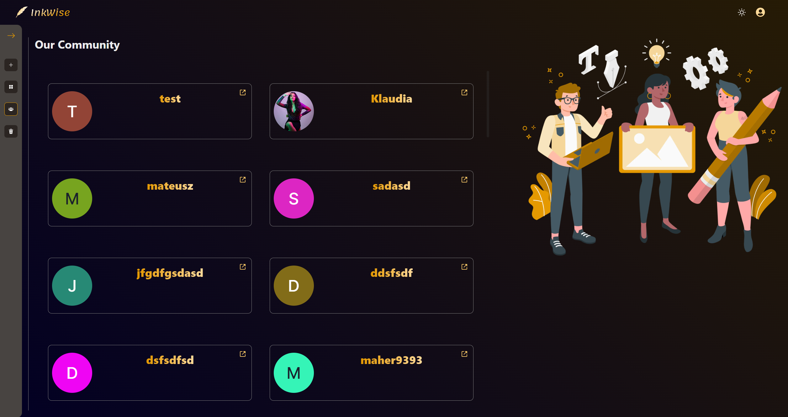
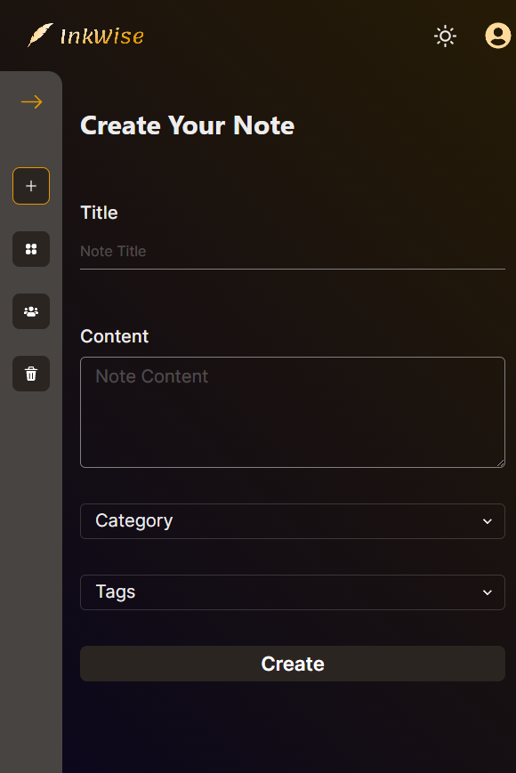

[](https://ink-wise.vercel.app/)
<h1 align='center'>Live 💻</h1> 

<p align='center'><a target='_blank' href='https://ink-wise.vercel.app/?vercelToolbarCode=3SLUBvVUdx5T5Tj' align='center' >✨ Ink Wise ✨</a></p>

</br>

## User is Able to: ✅

- Create an account and log in successfully.
- Change email, password or both
- Delete account
- Edit general info e.g. bio, profile image etc.
- Select a prefferred theme
- See main content only if logged in
- Create and menage notes. e.g. delete, update
- Restore deleted notes
- See entire community

</br>

## Built with 🛠

Tools | type |
---| --- |
React | JS library |
Next.js | React framework |
React-hook-form | Library for form validation |
ChakraUI | Library for UI |
Styled-components | Library for styles |
Framer-motion | Library for animation |
Firebase | Backend platform |


# Preview

### Community


### Signup page **( light mode )**


### Login page


### Create Note



## Run Locally

First, clone repository and install dependencies
```bash
git clone https://github.com/F4eNn/Ink-Wise.git
```
```bash
npm install
```

## Now you are able to run developer or production server:

 - ### Production
```bash
npm run start
```
 - ### Developer
```bash
npm run dev
# or
yarn dev
```
