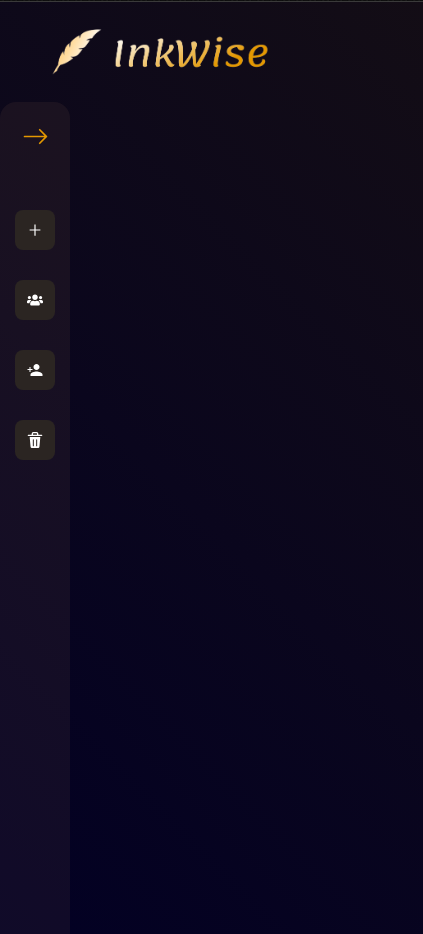

# Hello 😄 👋
## Currently in progress...🚧🛠️
## Live [here](https://ink-wise.vercel.app/?vercelToolbarCode=3SLUBvVUdx5T5Tj)

## Implemented behaviour

- Creating users via email and password.
- Secure login and user registration.
- Access to hidden content is available for logged-in users.
- Full validation of the login and registration.
- Changing the theme from dark to light.
- Fancy animation on home-page.
- View the optimal page layout depending on their device's screen size

## What I will implement next

- [x] Contact section
- [ ] Footer section **( currently )**

###  User profile site
- [ ] Description field
- [ ] Possibility to add and remove profile picture
- [ ] Allow to change password and username

## Tech-Stack 🔨
- Semantic HTML5 markup
- Mobile-first workflow
- [React](https://reactjs.org/) - JS library
- [Next.js](https://nextjs.org/) - React framework
- [Styled-components](https://styled-components.com/) - Library For styles
- [Chakra UI](https://chakra-ui.com/) - Library for UI
- [React-hook-fomr](https://react-hook-form.com/) - Library for form validation
- [Framer-motion](https://www.framer.com/motion/) - Library for animations
- [Firebase](https://firebase.google.com/) - Backend platform

## Preview

### Home page

### Signup page **( light mode )**

### Login page

### User pannel **( After loggin )**

### Mobile Friendly **( Home page )**


## Run Locally

First, clone repository and install dependencies
```bash
git clone https://github.com/F4eNn/Ink-Wise.git
```
```bash
npm install
```

## Now you are able to run developer or production server:

 - ### Production
```bash
npm run start
```
 - ### Developer
```bash
npm run dev
# or
yarn dev
```
